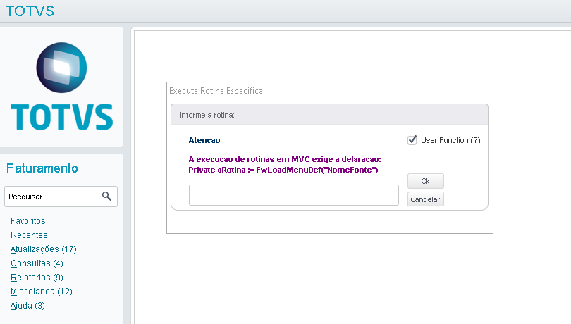

# Projetos e Exemplos em AdvPL

Este repositório tem como objetivo servir de base de conhecimento para auxiliar no desenvolvimento de novas customizações (AdvpL).

- [Executor de rotinas](./util/LBROTINA.prw) - permite executar rotinas customizadas\padrões. (Substituindo Formulas\Lançamento padrão.

- [Troca de Empresa em tempo de execução](./util/LBNEWEMP.prw) - classe responsavel por fazer a troca de empresa em tempo de execução.
- [Rotinas de uso geral](./util/LBXFUN.prw) - fonte com rotinas genericas.

